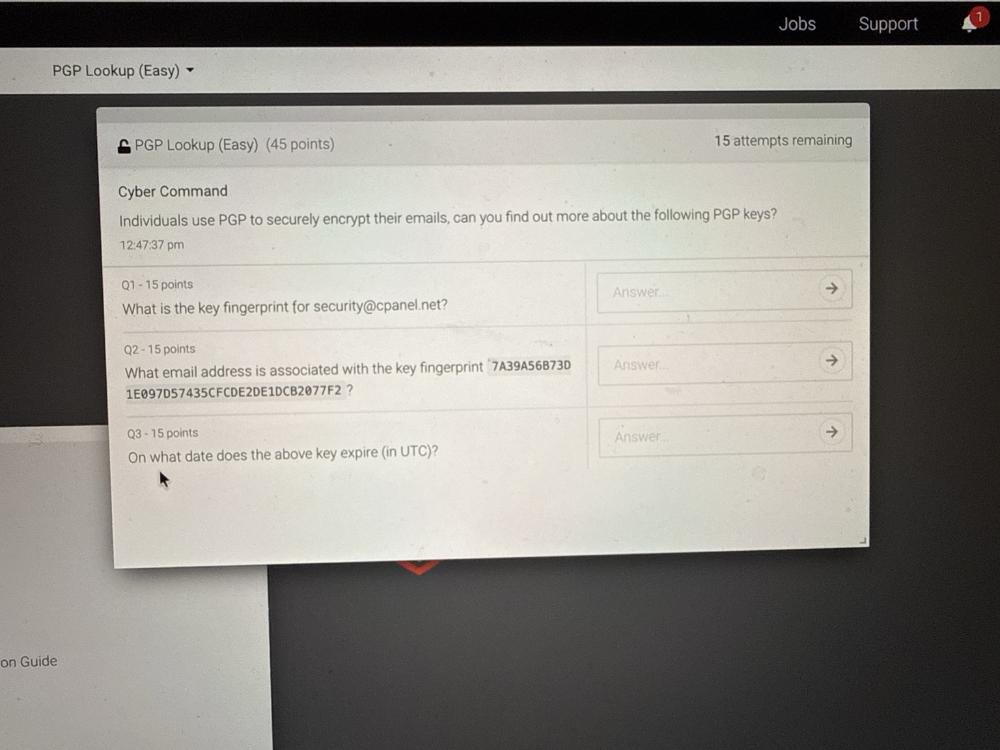
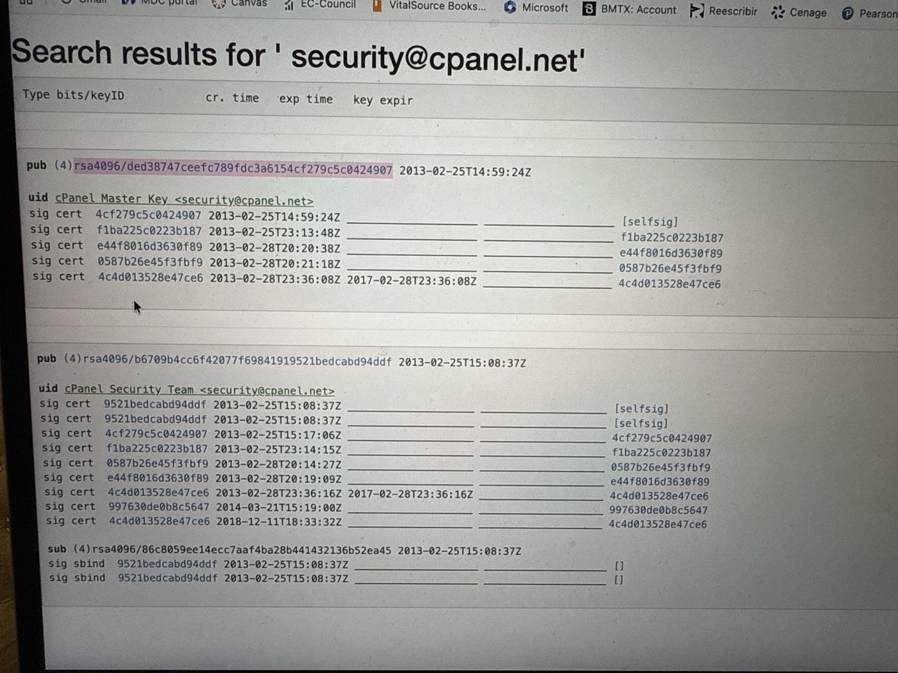
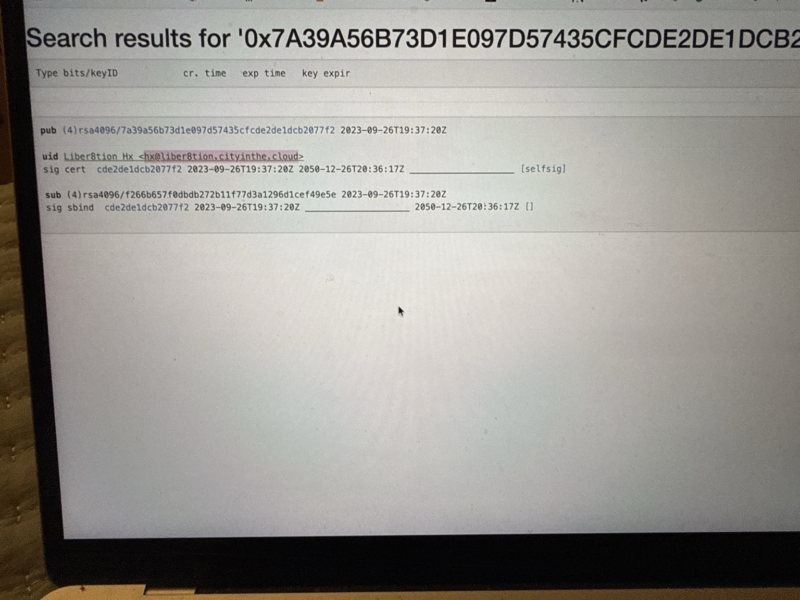

# PGP Key Lookup CTF

## Objective

Use a public PGP key database to find a key's fingerprint, identify the email address listed on another key, and determine when that key expires. This challenge focused on reading public key records, not encrypting or decrypting messages.

### Skills Learned

- Searched public PGP key records by both email address and fingerprint.
- Distinguished a key fingerprint from its shorter key ID and an email identity from its key details.
- Read creation and expiration timestamps correctly, including dates shown in UTC.

### Tools Used

- [Ubuntu OpenPGP Keyserver](https://keyserver.ubuntu.com/) in a web browser.
- Cyber Skyline challenge questions for the lookup targets.

## Steps

1. **Read the challenge.** The questions asked for the fingerprint associated with `security@cpanel.net`, the email associated with a supplied fingerprint, and that key's expiration date.

   

   *Ref 1: The challenge prompt provided an email address and a separate 40-character fingerprint to investigate.*

2. **Search by email.** I entered `security@cpanel.net` into the Ubuntu OpenPGP Keyserver. The search returned two public keys using that email. The `pub` lines show the full fingerprints after `rsa4096/`; the `uid` lines show the email associated with each key. For the cPanel Security Team entry, the fingerprint was `B6709B4CC6F42077F69841919521BEDCABD94DDF`.

   

   *Ref 2: Two keys appeared for the same address. I used the cPanel Security Team `pub` line for the requested fingerprint.*

3. **Search by fingerprint and read the dates.** I searched for `7A39A56B73D1E097D57435CFCDE2DE1DCB2077F2`. The `uid` line listed `hx@liber8tion.cityinthe.cloud`. The `2023-09-26T19:37:20Z` timestamp is the creation time; the expiration date shown farther right is `2050-12-26` in UTC.

   

   *Ref 3: The matching record contains the email identity and expiration date. I distinguished the expiration from the earlier creation timestamp.*

## Results

- **cPanel Security Team key fingerprint:** `B6709B4CC6F42077F69841919521BEDCABD94DDF`
- **Email on the supplied key:** `hx@liber8tion.cityinthe.cloud`
- **Expiration date (UTC):** `2050-12-26`

The keyserver displays published public key information. An email listed in a key record alone does not prove who controls that email address.
